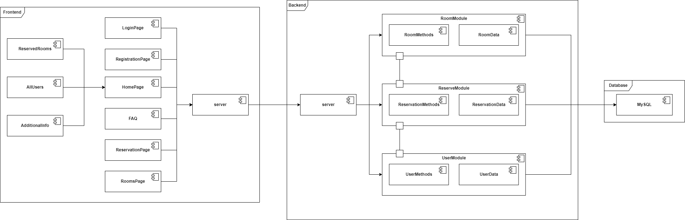

# CRM для готелів з управлінням бронюваннями
Система онлайн бронювання готелю розроблена для зручного електронного бронювання готелів. Вона надає можливість ефективно систематизувати дані про номери та їх стан, а також забезпечує доступ до редагування даних про бронювання.

--- 

# Технологічний стек

### Frontend: Vue.js

### Backend: Node.js

### Database: MySQL

---

# Функціональні можливості

## Авторизація та аутентифікація користувачів

#### • Є 2 ролі: адміністратор і звичайний користувач

#### • Усі користувачі повинні мати можливість зареєструватися та ввійти

## Управління бронюванням

#### • Усі користувачі можуть забронювати номер в готелі

#### • Усі користувачі можуть редагувати запис

## Управління кімнатами

#### • Усі користувачі можуть подивитися інформацію про кімнати

#### • Адміністратор може додавати нові кімнати; видаляти наявні кімнати; редагувати інформацію про кімнату

# Діаграма компонентів ПЗ

